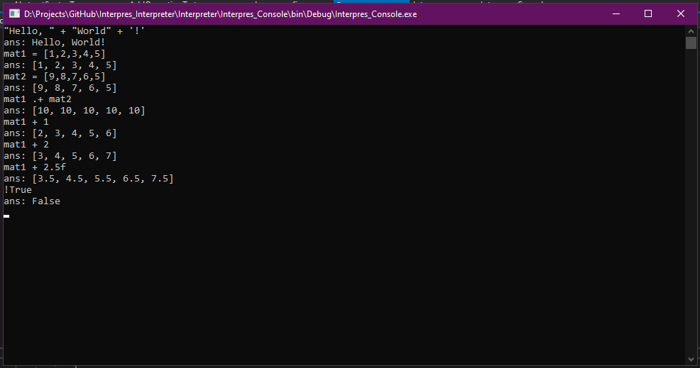

# Interpres

Interpres is a MatLab style interpreter system I created while studying Advanced Programming at the University of East Anglia.
This repository contains only the interpreting code. The front-end is contained in the Interpres_FrontEnd repository.

## Interpreter Features
(This list is not exhaustive)

- Binary and Unary Operators
 	- Numeracy
	- Bitwise
	- Logical
	- Matrix
- Variables
- Built-In Functions
	- Triganometric
	- File/IO
